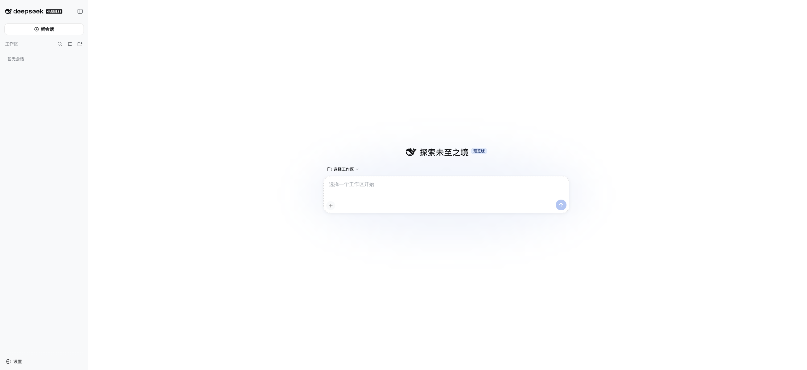
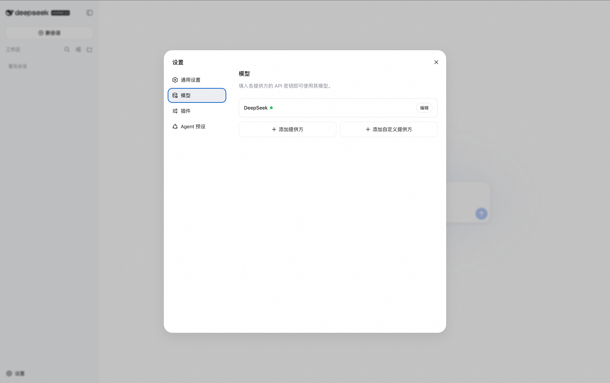
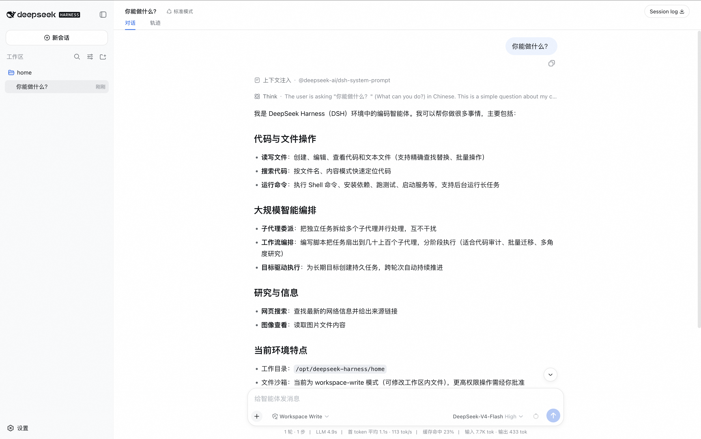

# DeepSeek-Harness Community Edition ComputeNest Deployment Guide

## Service Overview

DeepSeek-Harness Community Edition is an Agent Harness open-sourced by DeepSeek AI. It provides a browser-based Web UI where users can configure DeepSeek or OpenAI-compatible models, select a workspace, and run code agent tasks. This ComputeNest service uses a single-ECS deployment and automatically installs Node.js, the DeepSeek Harness Web UI, and an Nginx reverse proxy.

The service itself does not have a login interface. Therefore, access is gated by the ComputeNest Secure Proxy: users access the Web UI through the service instance output URL in the ComputeNest console. The ECS security group only allows traffic from the Secure Proxy egress CIDR ranges on port 3080 and does not expose an unauthenticated web service directly to the public internet.

## Service Architecture

The service template provisions a single-ECS deployment. The DeepSeek Harness Web UI listens on `127.0.0.1:13080` internally. Nginx listens on `0.0.0.0:3080` and reverse-proxies to the local Web UI. The ComputeNest Secure Proxy accesses port 3080 via the service instance output address.


## Billing

Building a service from this template incurs no charges. When deploying a service instance, resource costs mainly include:

- ECS instance type
- System disk capacity

Both pay-as-you-go and subscription billing methods are supported. Estimated costs are displayed in real time before deployment.

## Required Permissions for RAM Users

If you use a RAM user to create a service instance, you must grant the required permissions to the RAM user before creating the instance.

| Policy Name | Description |
| --- | --- |
| AliyunECSFullAccess | Full access to Elastic Compute Service (ECS) |
| AliyunVPCFullAccess | Full access to Virtual Private Cloud (VPC) |
| AliyunROSFullAccess | Full access to Resource Orchestration Service (ROS) |
| AliyunComputeNestUserFullAccess | Full access to ComputeNest user-side resources |

## Service Instance Deployment Workflow

### Deployment Steps

1. Open the ComputeNest service instance creation page. Select a region and fill in the instance type, instance password, and network parameters.

   [Deployment Link](https://computenest.console.aliyun.com/service/instance/create/cn-hangzhou?type=user&ServiceId=service-252a17b1e4cc425ca5f0)

2. After confirming the pricing details, click **Next: Confirm Order**. Accept the service agreement and click **Create Now**.

3. Wait for the service instance deployment to complete. Once finished, check the `deepseek_harness_3080_url` value in the **Outputs** section of the service instance details page.

4. Click the Secure Proxy URL in the outputs to open the Web UI. The page should display the DeepSeek Harness new session, settings, and workspace selection entry points.





## Initial Configuration

After opening the DeepSeek Harness Web UI, you cannot start a session immediately. You must first configure the model and workspace.

### 1. Configure the LLM Model

1. Click **Settings** in the lower-left corner.
2. Go to **Models** configuration.
3. Choose one of the following options to set up model access:
   - Enter a DeepSeek API Key to use the official DeepSeek model.
   - Add an OpenAI-compatible model provider by filling in the Provider ID, Base URL, API protocol, and API Key, and configure at least one model.
4. Save the configuration.

Without a configured model API Key, the Web UI can still be opened, but model requests will not work.

### 2. Select a Workspace

1. Return to the main page and click **Select Workspace**.
2. Choose the workspace directory you want the agent to operate on.
3. After selecting a workspace, the new session input box becomes functional.

The service instance prepares `/opt/deepseek-harness/workspace` on the ECS as the default working directory. DeepSeek Harness session data, credentials, storage, and attachments are stored under `/opt/deepseek-harness/dsh-home`.

## Operations & Maintenance

To troubleshoot the service on the ECS, connect to the instance using the instance password and run:

```bash
sudo systemctl status deepseek-harness.service
sudo systemctl status nginx.service
sudo journalctl -u deepseek-harness.service -n 100 --no-pager
```

The service startup script is located at `/opt/deepseek-harness/bin/start-dsh-web`, and application logs are at `/opt/deepseek-harness/logs/service.log`.

## Important Notes

- DeepSeek Harness is currently in developer preview. Future upstream versions may introduce breaking changes.
- Model API Keys configured in the Web UI are stored in the service instance's local persistent directory. Please manage instance access permissions carefully.

## Official Links

- [DeepSeek Harness GitHub](https://github.com/deepseek-ai/deepseek-harness)
